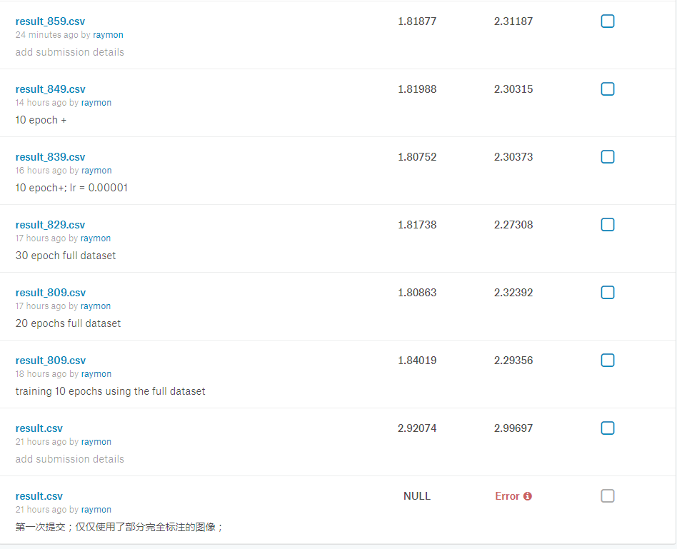
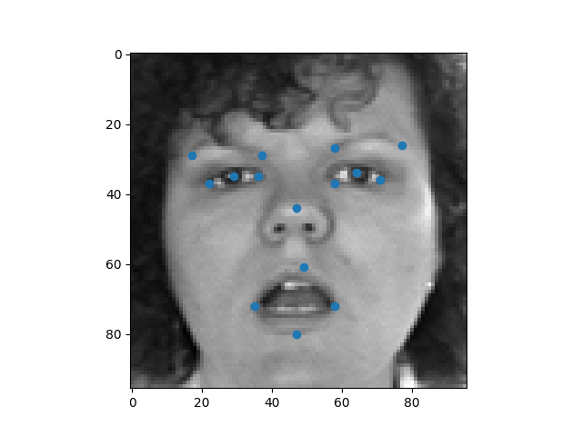
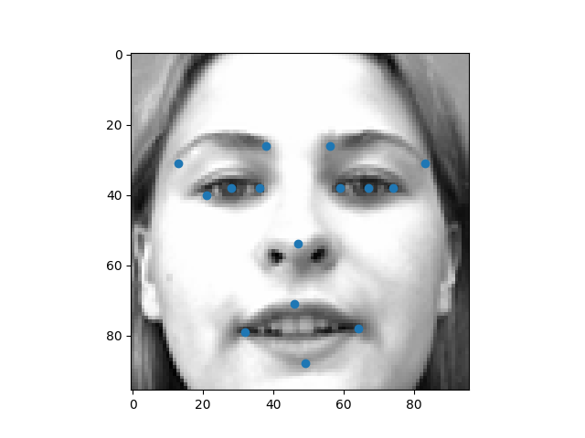
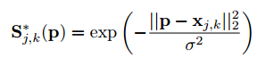
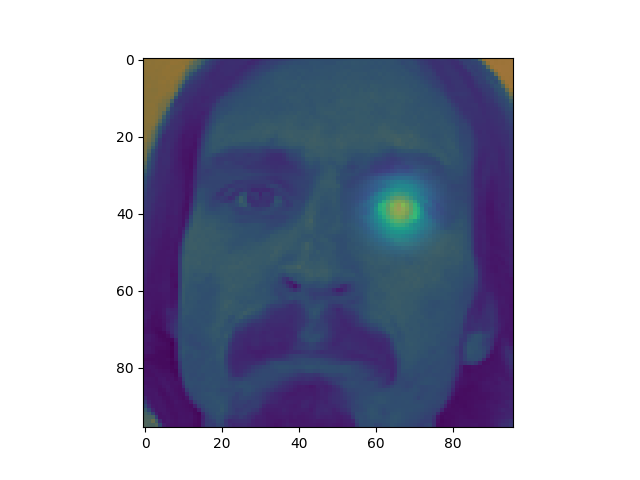
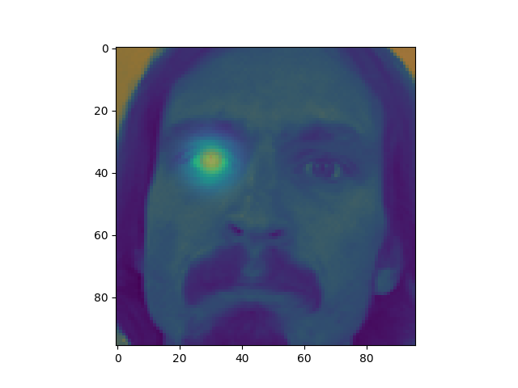
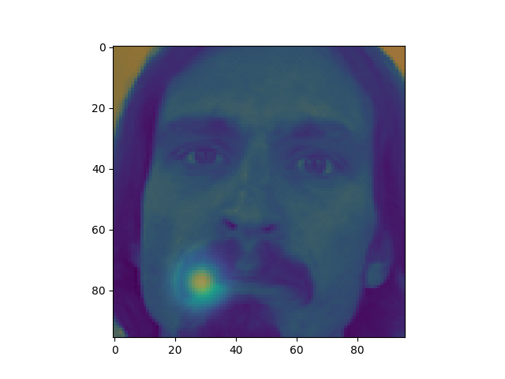
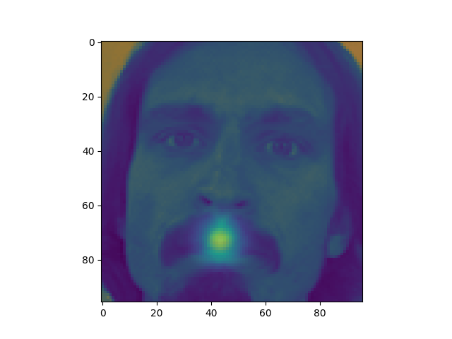
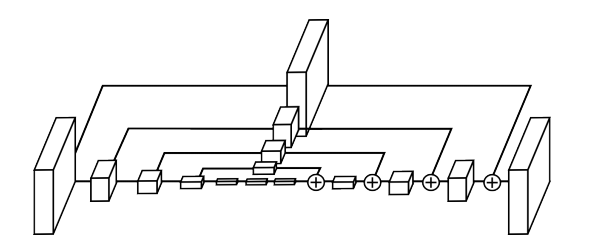
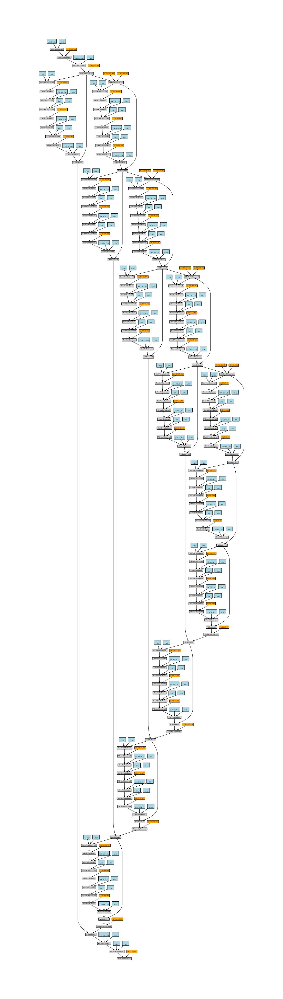

# 基于hourglass的人脸关键点检测

## 相关信息

* 项目来源：https://www.kaggle.com/c/facial-keypoints-detection
* 项目地址：https://github.com/raymon-tian/hourglass-facekeypoints-detection

## 成绩及演示

* kaggle用户名： raymon

* 成绩截图

  

  

* demo

  

  



## 相关工作

**人脸关键点检测任务**，隶属于**人体关节点检测任务**的中的子任务，所以现存的大量的针对人体关节点检测任务的工作都可以用于人脸关键点检测任务。对于人体关节点检测任务，存在的方法根据图像中人的数量可以分类成为两大类：1)单人体骨架提取。现存的代表性工作为[stackedhourglass](https://arxiv.org/abs/1603.06937)，该算法先是构建hourglass模型：以为一种递归的方式抽取不同尺度的特征图，小尺度的特征图会被进行上采样操作来达到和大尺度特征图一样尺度的特征图，再和大尺度特征图融合（相加）送入下一阶段的递归过程。然后该算法为了进一步提高精度，以一种中间监督的方式将多个hourglass堆叠到一起，从而形成了stackedhourglass，最后再对每个hourglass施加loss监督。2）多人骨架提取。大致上可以分为两类：1）基于检测。算法部署一个人体检测器（human detector），然后对每一个检测出来的人体，再进行单人的人体分析。该种方法的典型代表为[Mask-RCNN](https://arxiv.org/abs/1703.06870)；2）基于图模型。该类算法不进行人体检测，而是先图像中所有人的每个关节点都先检测出来，然后设法将不同种类的关节点组合起来形成单个的人体。诸多工作的不同之处就在于如果进行关键点的组合。代表工作之一，[CMU_pose](https://arxiv.org/abs/1611.08050)，使用向量场来将不同的关节组合成不同的肢干，逐步地得到不同的肢干，就可以得到完成的人体姿态；另一个典型工作是[Associative Embedding](https://arxiv.org/abs/1611.05424)，对每一个预测出来的关节点，同时预测一个embeddeding值，来表征该关节点属于哪一个组。

对于人脸关键点检测任务，可以简单地直接对坐标值进行回归，也可以基于人体关节点检测的工作，来通过构建其他学习目标来间接地获取坐标点。此次技术方案中构建热图（heatmap）以作为学习目标。

考虑到本次任务数据集并不复杂，所以本次任务直接在一个hourglass的基础上稍加适配任务性质的修改来加以预测。

## 方法

* 学习目标

  使用**2D高斯函数**来构建学习目标（heatmap）。将某一关键点的ground-truth作为中心点，这样一来，中心点处将具有最高的得分，越远离中心点，得分将越低。公式地表示，则有

  

* 可视化学习目标

  

  

  

  

* 网络结构：先将图像不改变尺度地进行卷积，得到合适数量通道的特征图，再将特征图送入hourglass模型，最后使用1x1的卷积，线性映射得到15张特征图，也就是预测得到的15张heatmap，每种关键点预测得到一张heatmap。另外，网络结构的设计并不改变输入的尺度，属于一种pixel-wise的全卷积网络（FCN）。

  hourglass 模型图

  

  本次算法中的网络结构图

  

* inference

  * 归一化图像：将像素值除以255，从而将所有像素值映射到[0,1]；
  * 调整网络输入：将网络输入reshape为(1,96,96)；
  * 网络预测：将输入送入网络，预测得到15张heatmap；输出为(15,96,96)；
  * 使用max算子，找出预测得到的每张heatmap中最大值所在的坐标作为对该种关键点的预测。

## 实验

* pytorch实现

* training

  1. 仅仅使用完全标注的数据(2140张图像)训练model，使用SGD，lr设置为0.001，训练10个epoch后发现loss不再下降（即使更换lr），但是model并不work，也就是出现了**loss无法下降的问题**；
  2. 换用adam进行优化，lr设置0.001，发现loss疯狂下降，10个epoch后，loss收敛，不再变化，测试模型work，提交得分为2.92；
  3. 使用全部的数据集进行训练，对于漏标的关键点，使用mask，不贡献loss，继续训练loss下降，10个epoch后，loss收敛，提交结果得分为1.84
  4. 更换lr为0.0005后继续训练，loss下降，10个epoch后，测试提交结果，得分为1.8086；
  5. 继续训练，发现得分基本稳定，或许效果变差了。

* 部分日志节选

  ```
  [ Epoch 00800 -> 00000 / 7049 ] loss : 0.000668076856527 loss_coor : 0.0844968110323 max : 1.22951054573 min : 0.0
  [ Epoch 00800 -> 00072 / 7049 ] loss : 0.000570345146116 loss_coor :  0.082247518003 max : 1.27145636082 min : 0.0
  [ Epoch 00800 -> 00144 / 7049 ] loss : 0.000559106993023 loss_coor :  0.083879455924 max : 1.15733075142 min : 0.0
  [ Epoch 00800 -> 00216 / 7049 ] loss : 0.000504959840328 loss_coor :   0.08310367167 max : 1.18976962566 min : 0.0
  [ Epoch 00800 -> 00288 / 7049 ] loss : 0.000570140429772 loss_coor : 0.0833380296826 max : 1.2717602253 min : 0.0
  [ Epoch 00800 -> 00360 / 7049 ] loss : 0.000506064505316 loss_coor : 0.0804231092334 max : 1.17254185677 min : 0.0
  [ Epoch 00800 -> 00432 / 7049 ] loss : 0.000406593986554 loss_coor : 0.0836449936032 max : 1.20352518559 min : 0.0
  [ Epoch 00800 -> 00504 / 7049 ] loss : 0.000405297701946 loss_coor : 0.0817726328969 max : 1.23924446106 min : 0.0
  [ Epoch 00800 -> 00576 / 7049 ] loss : 0.000487966550281 loss_coor : 0.0837124586105 max : 1.16643023491 min : 0.0
  [ Epoch 00800 -> 00648 / 7049 ] loss : 0.000363715342246 loss_coor : 0.0824847668409 max : 1.16725647449 min : 0.0
  [ Epoch 00800 -> 00720 / 7049 ] loss : 0.000432570668636 loss_coor : 0.0835245028138 max : 1.13535535336 min : 0.0
  [ Epoch 00800 -> 00792 / 7049 ] loss : 0.00042586523341 loss_coor : 0.0825248062611 max : 1.13426482677 min : 0.0
  [ Epoch 00800 -> 00864 / 7049 ] loss : 0.000455046625575 loss_coor : 0.0808562189341 max : 1.09106147289 min : 0.0
  [ Epoch 00800 -> 00936 / 7049 ] loss : 0.000385391729651 loss_coor :   0.08440952003 max : 1.09624230862 min : 0.0
  [ Epoch 00800 -> 01008 / 7049 ] loss : 0.00059827347286 loss_coor : 0.0826571434736 max : 1.15060770512 min : 0.0
  [ Epoch 00800 -> 01080 / 7049 ] loss : 0.000396907416871 loss_coor : 0.0815715491772 max : 1.13137769699 min : 0.0
  [ Epoch 00800 -> 01152 / 7049 ] loss : 0.000362811610103 loss_coor : 0.0865842476487 max : 1.08385503292 min : 0.0
  [ Epoch 00800 -> 01224 / 7049 ] loss : 0.000393233931391 loss_coor : 0.0852425917983 max : 1.11058795452 min : 0.0
  [ Epoch 00800 -> 01296 / 7049 ] loss : 0.000454480032204 loss_coor : 0.0859401002526 max : 1.10379803181 min : 0.0
  [ Epoch 00800 -> 01368 / 7049 ] loss : 0.000389240361983 loss_coor : 0.0848914980888 max : 1.0531847477 min : 0.0
  [ Epoch 00800 -> 01440 / 7049 ] loss : 0.000810728233773 loss_coor : 0.0820694491267 max : 1.0755417347 min : 0.0
  [ Epoch 00800 -> 01512 / 7049 ] loss : 0.000508533208631 loss_coor : 0.0811709463596 max : 1.11292123795 min : 0.0
  [ Epoch 00800 -> 01584 / 7049 ] loss : 0.000415266724303 loss_coor : 0.0858198255301 max : 1.05843913555 min : 0.0
  [ Epoch 00800 -> 01656 / 7049 ] loss : 0.000354411109583 loss_coor : 0.0838029235601 max : 1.08815252781 min : 0.0
  ```

  ​

## 参考

* Stacked Hourglass Networks for Human Pose Estimation:https://arxiv.org/abs/1603.06937
* Mask R-CNN:https://arxiv.org/abs/1703.06870
* Realtime Multi-Person 2D Pose Estimation using Part Affinity Fields:https://arxiv.org/abs/1611.08050
* Associative Embedding: End-to-End Learning for Joint Detection and Grouping:https://arxiv.org/abs/1611.05424